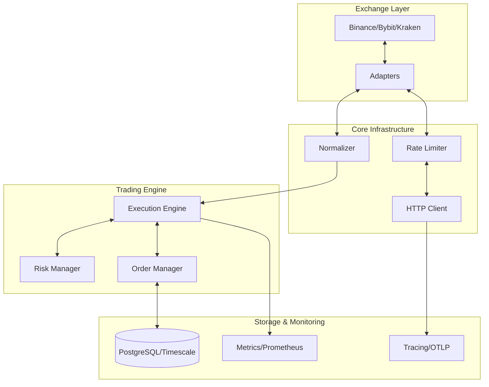

# Algorithmic Trading Platform

A Python-based algorithmic trading framework for strategy development, backtesting, and execution research across multiple exchanges.

## Architecture

The system is designed with a modular, asynchronous architecture focusing on scalability, security, and risk management.

### Core Modules

- **`/adapters`**: Multi-exchange support (Binance, Kraken, Coinbase) with a unified interface.
  - Asynchronous HTTP/WebSocket clients using `httpx`.
  - Built-in rate limiting and automatic retry logic.
- **`/algorithms`**: Modular strategy engine.
  - `BaseAlgorithm` abstract interface for custom strategy development.
  - `QuantConnectAdapter` for seamless integration of QC-style strategies.
- **`/order_management`**: Complete OMS handling order lifecycle, tracking, and bracket orders (SL/TP).
- **`/risk_management`**: Advanced risk controls including position sizing, drawdown circuit breakers, and per-trade risk checks.
- **`/database`**: SQLAlchemy-based ORM for PostgreSQL, storing trades, orders, algorithms, and logs.
- **`/backtesting`**: Event-driven backtesting engine with comprehensive performance metrics (Sharpe, Sortino, Drawdown, etc.).
- **`/logging`**: Structured logging using `loguru` for trading events and system health.
- **`/config`**: Environment-based configuration management using Pydantic.

## Implementation Status

The platform has reached a significant milestone with ~24,000+ lines of Python code implemented across 8+ exchange adapters and robust core infrastructure.

### Completed Exchange Adapters
| Exchange | Status | Features | File Path |
|----------|--------|----------|-----------|
| **Binance** | COMPLETE | Spot, WebSocket, User Streams | `adapters/binance.py` |
| **Bybit** | COMPLETE | Unified API, Spot/Futures | `src/adapters/bybit.py` |
| **Kraken** | COMPLETE | REST, WebSocket Integration | `adapters/kraken.py` |
| **Coinbase** | COMPLETE | Advanced Trade API | `adapters/coinbase.py` |
| **Hyperliquid** | COMPLETE | L1/L2 Market Data, Execution | `src/adapters/hyperliquid.py` |
| **Testnet** | COMPLETE | Universal Mock Interface | `src/adapters/testnet.py` |

### Core Infrastructure
- **API Client Management**: Async `httpx` wrapper with jittered exponential backoff and distributed rate limiting (`src/rate_limiter/`).
- **Distributed Tracing**: Full OpenTelemetry integration for cross-service correlation (`src/tracing/`).
- **Metrics & Monitoring**: Real-time Prometheus metrics collection for latency, errors, and system health (`src/metrics/`).
- **Database Engine**: SQLAlchemy 2.0 async models with TimescaleDB support for high-frequency market data (`database/`).
- **Risk Management**: Multi-tier risk engine supporting Kelly Criterion sizing and fixed/trailing stop losses (`risk_management/`).

### System Architecture

*Legend: Green = Fully Implemented | Yellow = Partially Implemented | Blue = Foundation Ready*

## Quick Start

### 1. Simple Market Fetch Example
```python
import asyncio
from adapters.binance import BinanceAdapter

async def main():
    async with BinanceAdapter(api_key="...", api_secret="...") as binance:
        ticker = await binance.get_ticker("BTCUSDT")
        print(f"Current Price: {ticker.last_price}")

asyncio.run(main())
```

### 2. List Available Strategies

```bash
python main.py list-strategies
```

### 3. Run a Backtest

```bash
python main.py backtest --strategy sma_crossover --symbol BTCUSDT --start 2023-01-01 --end 2024-01-01
```

### 4. Run the Test Suite

```bash
pytest -q
```

### 5. CI and Merge Protection

- GitHub Actions CI runs on pull requests to `main`, on pushes to active development branches, and via manual dispatch.
- The `required-checks` workflow status is configured as a required branch protection rule on `main`.
- Pull requests to `main` cannot merge unless the CI matrix passes.

## Strategy Development

All strategies should inherit from `BaseAlgorithm`.

```python
from algorithms import BaseAlgorithm, Signal
from adapters import OrderSide, OrderType

class MyStrategy(BaseAlgorithm):
    def on_data(self, data):
        # Implementation of strategy logic
        # Return a Signal object for execution
        pass

    async def on_execute(self, signal):
        # Execute trade via self.execute_trade()
        pass

    async def on_order_filled(self, order):
        # Handle post-fill logic
        pass
```

## Security & Safety

- **Rate Limiting**: Automatic throttling per exchange requirements.
- **Circuit Breakers**: Halts trading automatically if drawdown or loss limits are breached.
- **Encrypted Storage**: Recommended use of Secrets Manager for API keys (env var support built-in).
- **Safe Execution**: All orders are validated against risk parameters before submission.

## Development Notes

- The lightweight CLI entrypoint lives in [`src/cli.py`](src/cli.py) and is exposed through `main.py`.
- The risk-aware sample strategy lives in [`src/strategy/sma_crossover_risk.py`](src/strategy/sma_crossover_risk.py).
- Local broker-facing test adapters live in [`src/broker/`](src/broker/).

## Agent Instructions

- Shared repository instructions live in [`AGENTS.md`](AGENTS.md).
- Cross-agent shim files are provided for common tools:
  - [`CODEX.md`](CODEX.md)
  - [`CLAUDE.md`](CLAUDE.md)
  - [`GEMINI.md`](GEMINI.md)
- Each shim delegates back to `AGENTS.md` so the repo has a single instruction source of truth.

## Requirements

- Python 3.10+
- PostgreSQL
- Dependencies listed in `requirements.txt`

---
*Disclaimer: Use this software at your own risk. Trading involves significant risk of loss.*
