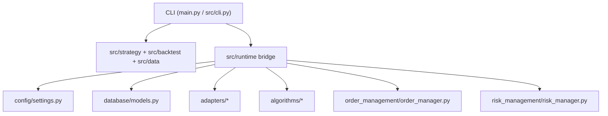
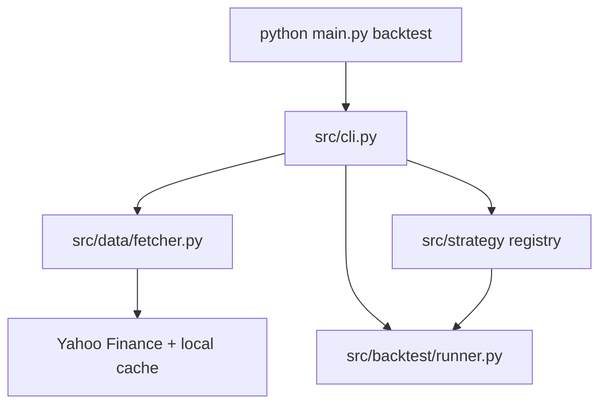
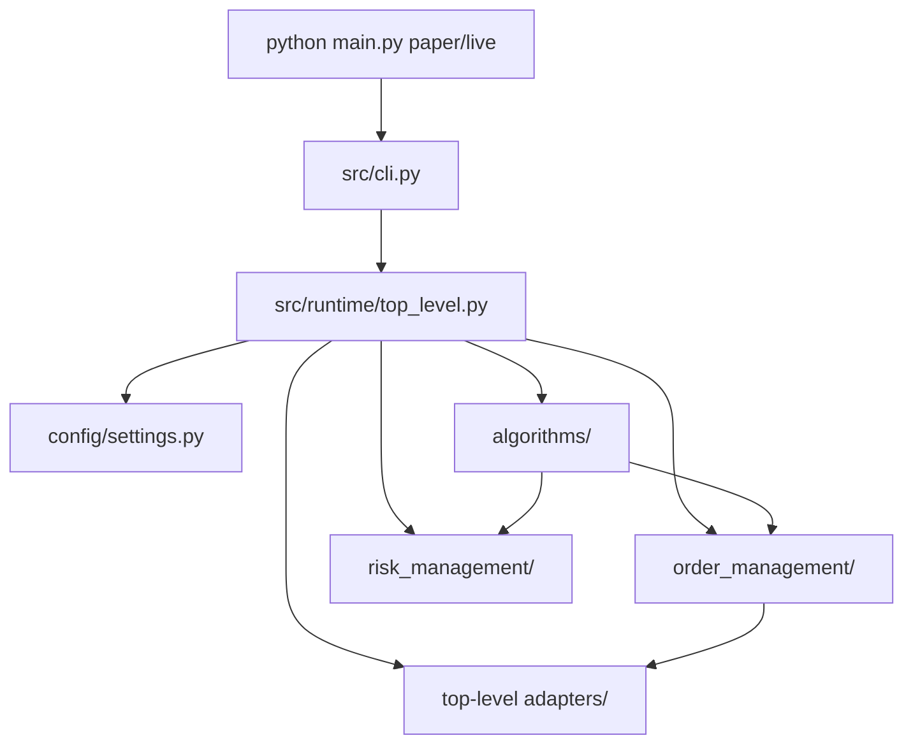

# Architecture

This document describes the architecture that is executable in the repository today. It focuses on the code paths a contributor can actually run, test, and reason about now.

## 1. Canonical Entry Point

The shipped command-line entry point is:

```text
main.py -> src/cli.py
```

That entrypoint exposes:

- lightweight strategy discovery and backtesting
- database initialization
- a runtime bridge into the top-level async trading stack

## 2. The Three Important Surfaces

There are three distinct surfaces worth understanding.

### A. Lightweight Local Surface

Primary purpose:

- fast local strategy development
- backtesting
- simpler test harnesses

Main packages:

- `src/strategy/`
- `src/backtest/`
- `src/data/`
- `src/risk/`
- `src/execution/`
- `src/broker/`

Primary commands:

- `list-strategies`
- `backtest`

### B. Top-Level Async Runtime Surface

Primary purpose:

- exchange connectivity for the shipped runtime
- order management
- runtime risk gating
- database-backed and logging-backed execution services

Main packages:

- `adapters/`
- `algorithms/`
- `order_management/`
- `risk_management/`
- `database/`
- `config/`
- `trading_logging/`

Primary commands:

- `init-db`
- `paper`
- `live`

### C. Extended Adapter Toolkit

Primary purpose:

- richer or newer adapter infrastructure
- auxiliary auth/signing primitives
- extended venue implementations
- adapter-focused helpers not currently forming the main shipped runtime boundary

Main package:

- `src/adapters/`

This surface is important, but it is not the adapter surface used by the current `paper/live` runtime bridge.

## 3. Runtime Flow

### High-Level Flow



### Backtest Flow



### Paper/Live Flow



## 4. What Each CLI Command Uses

| Command | Implementation Surface | Notes |
|---|---|---|
| `list-strategies` | lightweight `src/strategy` registry | Only lists registered lightweight strategies |
| `backtest` | `src/data`, `src/strategy`, `src/backtest` | Best starting point for strategy iteration |
| `init-db` | `src/runtime/database.py` + `database/` + `config/` | Creates the configured schema |
| `paper` | `src/runtime/top_level.py` + top-level runtime packages | Dry-run by default |
| `live` | same as `paper`, but using live endpoints | Real execution still explicitly guarded |

## 5. Strategy Architecture

### Lightweight Strategies

Lightweight strategies inherit from the `BaseStrategy` contract under `src/strategy/__init__.py`.

They are designed for:

- simple signal generation
- DataFrame-based local processing
- backtest runner compatibility

They are not automatically runtime strategies for `paper/live`.

### Top-Level Runtime Strategies

Runtime strategies inherit from `algorithms/base_algorithm.py`.

They are designed for:

- symbol-to-DataFrame runtime inputs
- order manager integration
- risk manager integration
- asynchronous lifecycle hooks

If you want a strategy to run under `paper/live`, it must exist in this top-level algorithm layer and be wired into the runtime bridge.

## 6. Risk Architecture

There are two risk implementations because there are two main runtime surfaces.

### Lightweight Risk

Path:

- `src/risk/manager.py`

Purpose:

- support local strategy/backtest/execution tests
- provide simple position sizing and circuit-breaker behavior

### Top-Level Runtime Risk

Path:

- `risk_management/risk_manager.py`

Purpose:

- support the top-level OMS and runtime execution path
- track broader portfolio-level runtime controls

Important contributor rule:

- keep risk semantics aligned when touching behavior that exists in both surfaces
- do not casually modify `risk_management/`

## 7. Adapter Architecture

### Top-Level `adapters/`

This is the adapter layer the shipped runtime uses today.

It provides:

- the adapter interface used by top-level algorithms and OMS
- exchange implementations wired into `paper` and `live`
- the domain models imported by the top-level runtime

### `src/adapters/`

This is a broader adapter toolkit with:

- richer auth and signing primitives
- normalizers
- health-monitoring utilities
- additional or newer venue support
- adapter-focused helpers and tests

This split is one of the repo's biggest conceptual sharp edges. It is manageable, but contributors should not treat both packages as one unified subsystem.

## 8. Database Architecture

The database layer lives under `database/` and is initialized through the CLI.

Core tables include:

- `algorithms`
- `orders`
- `trades`
- `positions`
- `transactions`
- `system_logs`
- `backtest_results`

The current shipped command for schema creation is:

```bash
python main.py init-db
```

## 9. Logging Architecture

Logging is bootstrapped explicitly through the main entrypoint before CLI parsing.

Goals of the current logging setup:

- provide one canonical runtime bootstrap path
- keep logging behavior consistent across CLI entry flows
- preserve hardening around sensitive configuration handling

## 10. Architectural Strengths

The current structure is good in these areas:

- one canonical entrypoint
- clear supported CLI surface
- explicit split between fast local work and richer runtime work
- reasonable test coverage around the shipped path
- risk and execution boundaries are visible rather than hidden

## 11. Architectural Weaknesses

The main structural weaknesses are:

- duplicated domain concepts across multiple surfaces
- split adapter surfaces
- split risk surfaces
- top-level runtime strategy support narrower than the lightweight strategy set

These are important maintenance costs, but they do not make the repo unusable. They just mean contributors should optimize for clarity and avoid creating even more parallel abstractions.

## 12. Recommended Direction

If you are improving structure here, the most valuable direction is:

1. strengthen the current shipped CLI/runtime path
2. document boundaries clearly
3. avoid adding new parallel surfaces
4. gradually consolidate duplicated domain models when there is clear payoff
