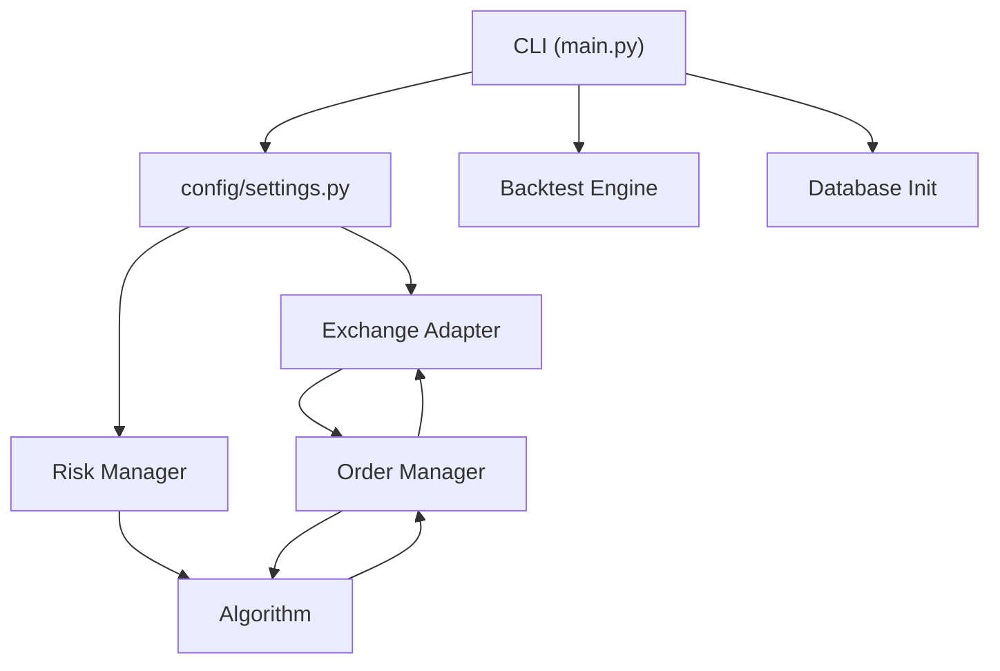
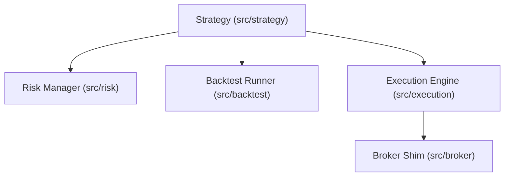

# Architecture

## Current Architecture, Not Aspirational Architecture

This document describes the code that is actually present in the repository today.

## 1. Top-Level Async Runtime

The top-level runtime is built around these packages:

- `adapters/`
- `algorithms/`
- `order_management/`
- `risk_management/`
- `backtesting/`
- `database/`
- `config/`
- `trading_logging/`

`main.py` wires those parts together for the supported CLI commands.

### Runtime Flow

### Responsibilities

- `adapters/`: venue-specific auth, REST/WebSocket I/O, normalization, and request signing
- `algorithms/`: top-level strategy lifecycle, QC-style adapter support, and signal execution helpers
- `order_management/`: submission and bracket-order orchestration
- `risk_management/`: portfolio risk checks, position sizing, and circuit-breaker behavior
- `backtesting/`: async event-driven backtest surface for the top-level runtime
- `database/`: SQLAlchemy models and migration wiring
- `trading_logging/`: shared logging setup with `loguru` when installed and stdlib fallback otherwise

## 2. Lightweight Compatibility Layer

The `src/` tree is a second implementation surface used by the current tests. It contains:

- `src/strategy/`
- `src/risk/`
- `src/execution/`
- `src/backtest/`
- `src/broker/`

This layer is intentionally lighter weight than the top-level runtime. It is useful for fast unit and integration tests, but it duplicates concepts that already exist in the top-level async stack.

### Lightweight Flow

## 3. Why The Duplication Matters

The repo’s biggest remaining design issue is that both layers expose similar concepts:

- strategy base classes
- risk managers
- execution engines
- broker or adapter abstractions
- backtesting surfaces

That duplication increases maintenance cost and makes documentation drift likely. The current docs and test harness are now aligned with reality again, but the long-term fix is consolidation.

## 4. Logging

Structured logging now lives in `trading_logging/`.

- The old `logging/log_config.py` path was removed because it collided with Python’s stdlib `logging` module.
- `trading_logging/log_config.py` supports `loguru` when installed.
- If `loguru` is unavailable, it falls back to stdlib logging so imports still work in minimal environments.

## 5. Packaging

`pyproject.toml` is the primary packaging manifest.

- The console entry point is `algo-trade = "main:main"`.
- Runtime dependencies now include the HTTP, database, exchange, websocket, settings, and logging libraries that the packaged code actually imports.
- `requirements.txt` remains a convenience install path, but packaging should be driven from `pyproject.toml`.

## 6. Operational Status

### Backtesting

- Top-level backtesting exists in `backtesting/engine.py`.
- Lightweight backtesting exists in `src/backtest/runner.py`.
- The lightweight path is what the current integration suite exercises most directly.

### Paper Trading

- `main.py paper` wires config, adapter, order manager, risk manager, and algorithm setup.
- The main loop is still a placeholder and should not be treated as production-complete paper trading.

### Live Trading

- `main.py live` is intentionally guarded and currently stops after confirmation with a “not yet implemented” message.

## 7. Recommended Cleanup Plan

1. Pick one public runtime surface and deprecate the other.
2. Move remaining shared concepts behind one canonical set of data models.
3. Add CI to keep imports, tests, and packaging healthy.
4. Add environment-backed adapter checks for the venues that matter operationally.
