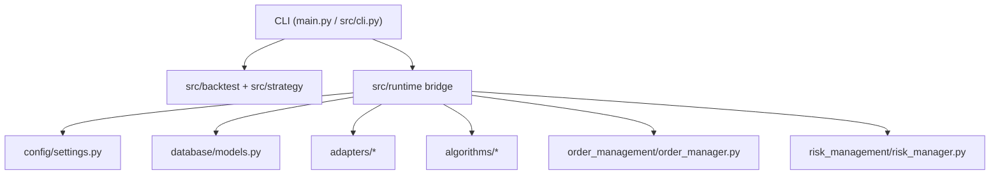

# Architecture

This document describes the code that is executable in the repository today.

## 1. CLI Entry Point

The shipped command-line entry point is:

```text
main.py -> src/cli.py
```

That CLI now exposes both the lightweight local stack and selected top-level async runtime services.

## 2. Executable Surfaces

### Lightweight Surface

Used for fast local workflows and most of the current direct test coverage:

- `src/backtest/`
- `src/broker/`
- `src/data/`
- `src/execution/`
- `src/risk/`
- `src/strategy/`

This is the path behind `list-strategies` and `backtest`.

### Top-Level Async Surface

Used for richer exchange/runtime operations:

- `adapters/`
- `algorithms/`
- `order_management/`
- `risk_management/`
- `backtesting/`
- `database/`
- `config/`
- `trading_logging/`

This surface is now reachable from the CLI through:

- `init-db`
- `paper`
- `live`

## 3. Runtime Flow



## 4. What Each CLI Command Uses

- `list-strategies`: lightweight `src/strategy` registry
- `backtest`: lightweight `src/data`, `src/strategy`, and `src/backtest`
- `init-db`: top-level `config` + `database`
- `paper`: top-level adapters, algorithms, OMS, and risk manager through a safe polling bridge
- `live`: same bridge, but pointed at live market endpoints and guarded before order execution

## 5. Safety Model

- Logging is centralized in `trading_logging/log_config.py`.
- Risk-gated execution exists in both the lightweight execution engine and the legacy/top-level OMS.
- `paper` and `live` default to signal-only dry-run mode.
- Real live order execution requires explicit CLI intent with `--execute-orders --confirm-live`.
- `risk_management/` remains protected behavior.

## 6. Architectural Improvement Since The Previous Pass

The repo still has two implementation layers, but the biggest source of drift is reduced:

- the lightweight stack is still the fast local path
- the top-level async stack is no longer stranded as undocumented library code
- the CLI now bridges into both surfaces in a deliberate, tested way

The next major architectural milestone would be deeper model/service consolidation, not basic surface wiring.
